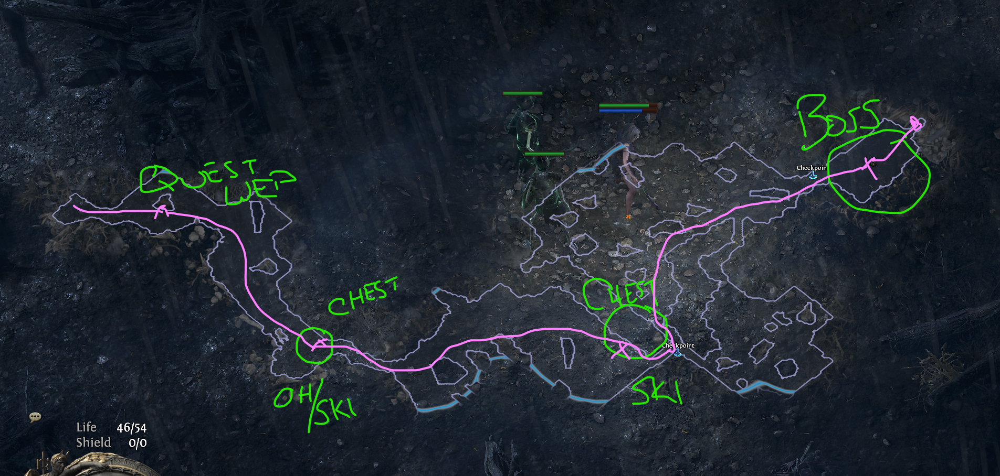
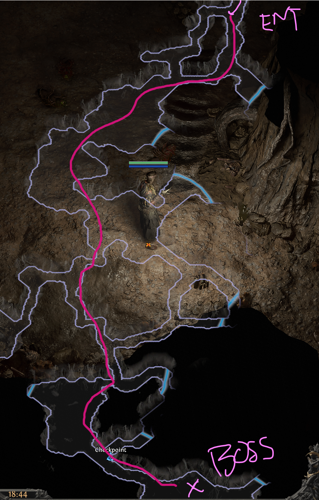
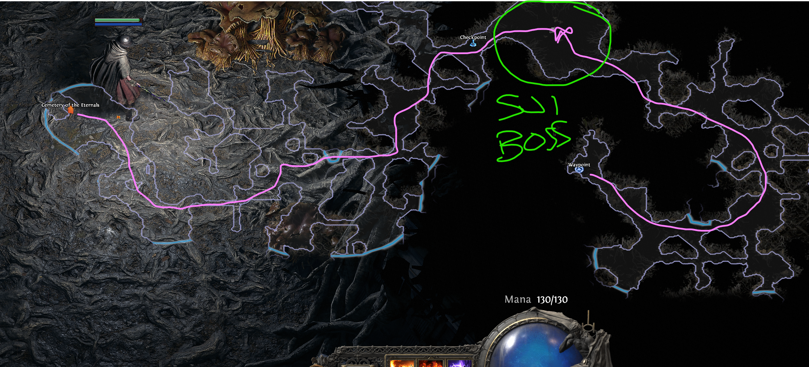
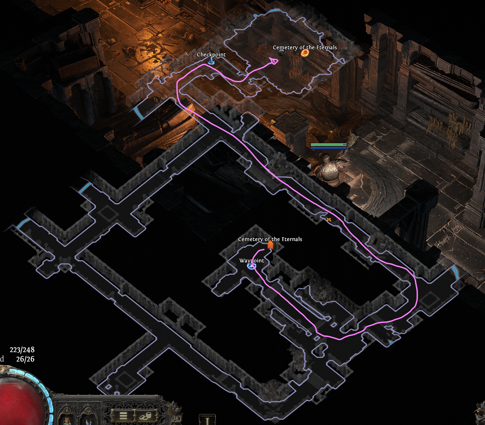
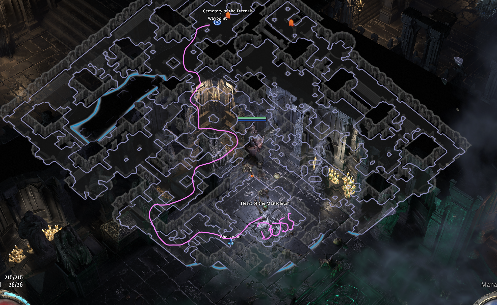
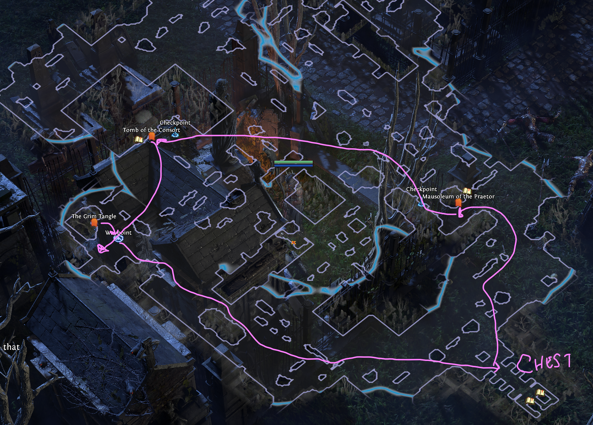
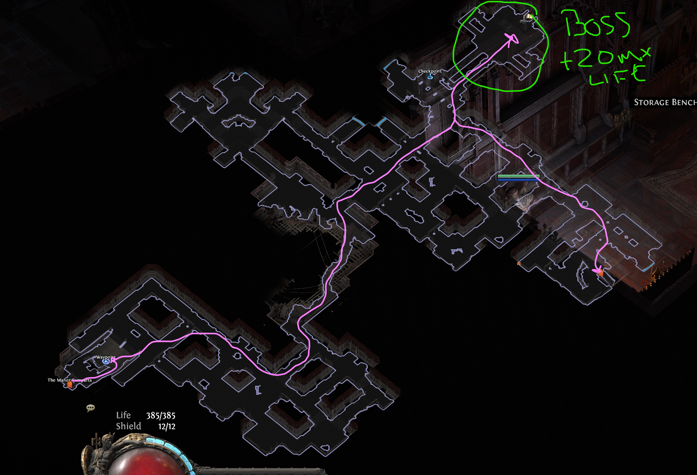
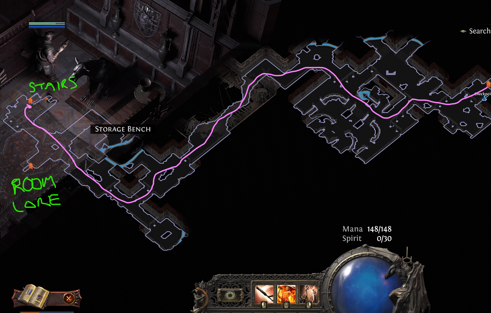
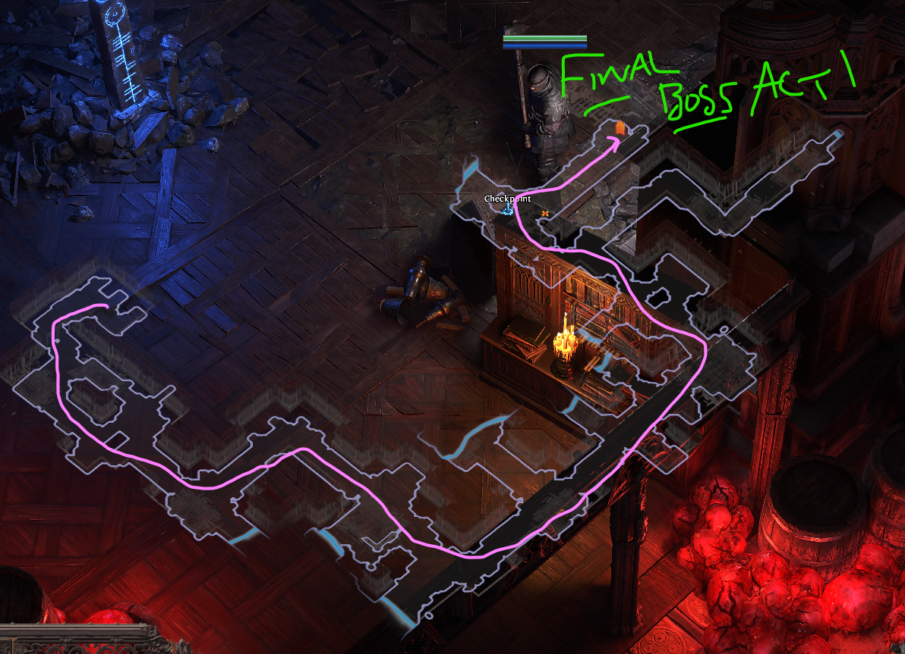

# Act 1 - Route

## The Riverbank
1. Let the Journey Begin! 
2. Talk to the NPC for a quest, you'll get your first Main Hand (MH) here. 
3. Begin running east to find a large chest with either your first Skill Gem 1 (SK1) or an Off Hand (OH). 
4. Continue running east where you should encounter your first checkpoint & second large chest which contains a SK1. You might need to search around for the chest if you've missed, either before or after the Checkpoint.
5. Start running Northeast to find the second checkpoint and the first boss fight. Relatively easy, just dodge roll the slam & charge.
6. Once dead, Enter Clearfell Encampment where you'll talk to Renly for another SK1. You can vendor gear from boss fight, but also **CONSTANTLY CHECK boots for movement speed with each portal to town. Helps with clearing Act I faster.**

## Clearfall
1. (Optional) Route for SK1 from Mysterious Chest 
2. Grab Waypoint next to Mud Burrow, will teleport later for SU1
3. Slay Ice Witch for 10% Cold Resistance -- easy kill
4. Travel north to The Grelwood, entrance will be along the northern wall, run up or down until you see light

## The Grelwood - Part 1
Order doesn't matter as this varies. If you find "The Red Vale" last, jump to route in for [The Red Vale](#the-red-vale). If you find either the Witch of Brambles last portal to town and TP The Red Vale
1. (Optional) Kill witch for SU1 -- easier & quicker than Mud Burrow Boss for SU1
2. Unlock waypoint by Tree of Souls (Where the Hooded One Hangs)
3. Unlock waypoint for The Red Vale and zone back
4. (Optional) Kill Brambles Boss for SK2
5. Unlock Grim Tangle Waypoint then teleport to The Red Vale

## The Red Vale
Layout seems to remain similar, basically always one south/bottom right, with two to the west/middle-left and northwest/top left.
1. Run for bottom right obelisk first
2. West most obelisk
3. Nothern most obelisk for boss -- just always staying on his ass seems to make an easy strat
4. Portal to town and talk to Vanly to make Runed Spikes

## Mud Burrow (Optional -- quick SU1): [Skip](#the-grelwood---part-2)
Optional for a second SU1, relatively fast give you're level & hopefully found a few good peices for power.

1. Teleport to Clearfall -- waypoint is next to Mud Burrow
2. Run directly opposite the waypoint as much as you can until you make it to boss room
3. He should die quick, once dead portal to town & hand-in for SU1

## The Grelwood - Part 2
Now that you have the relics from The Red Vale you can stab the tree of souls to free
1. Stab three spikes into the tree to release The Hooded One and return to town -- mindful there is one second animation when clicking on each root
2. Take waypoint back to Clearfall Encampment and talk to Una
3. Teleport to Grim Tangle

## The Grim Tangle
1. Talk with Una to unlock and begin searching for the Cemetary of the Eternals
    - Seemingly looking out for the yellow glowing plants seems to be an indicator of the correct direction to go (TODO: still testing, west of waypoint for 2 runs)
2. (Optional) Kill Boss for SU1, careful of him holding hand infront of him he's going to throw cluster explosions
3. Head for the Entrance to "Cemetary of the Eternals"

## Cemetary of the Eternals
1. Discover waypoint by The Grim Tangle zone entrance.
2. (Optional) You may come accross the Ancient Ruin while searching for the next step. This is a chest with free loot, generally underwhelming, but also provides a checkpoint.
3. Begin looking for the following two zones, order of completion does not matter:
    - **Tomb of the Consort** -- lady boss with big AoEs that can hit hard.
        - Route may vary, just find the boss asap and kill. 
    - **Mausoleum of the Praetor** -- dude boss who's only scary when he calls up for lady bosses AoE
        - Route may vary, but just find boss and kill. You may stumble upon a treasure room in here for some extra gold and a chest. 
4. After each of them has been kill return to Lachlann by Cemetary of the Eternals waypoint
5. Follow him to graves and kick some boss butt -- careful of the action when he summons the frosty bird from ground that kamikaze you they hurt.
6. Enter Hunting Grounds after he drops his loot

## Hunting Grounds
1. Unlock waypoint for Hunting Grounds
2. Crowbell Boss for +2 Weapon Skill Passive Points -- look for the area circled in green, the go further to start the boss
3. (Optional) Clear the Druid Ritual for a SK4
4. (Optional) Clear the Ritual Alter for Finn Quest
5. Get the waypoints for "Ogham Farmlands" or "Freythorn", **IF you find Freythorn last, stay here and follow [Freythorn](#freythorn) -- this is for the first SP1 and +30 spirit.

## Freythorn
Important Powerboost either for Defense or Offense to give yourself +30 Spirit, SP1 and your first charm slot.
1. Unlock waypoint for Freythorn
2. Begin Searching for the Ritual Altars, search north or south first. It always seems to be one or the other. 
    - TODO: I still need to test but based on how you enter might determine it's location. It seems always opposite the entrance, so entering North, Altars sout; Entering South, Altars North, Entering West, Altars East
3. Last Altar is locked to the Boss Room, you have to get all the others prior.
4. Last Altar has waves prior, boss has 2 phases.
    - Be careful about the totems as they add pulsing AoE damage, they usually take one hit to knock down.
    - TODO: There's also the Red Rune which I'm still testing how to avoid.
5. After Boss dead, use item drop for +30 Spirit & select your SP1 gem selection. Make sure in Skill Window (G), to click arrow next to dmg/dps and assign to Weapon Slot(s) for activation.
6. DO NOT forget to check alter for any useful items or currency. Usually nothing special, but did get a good early game 2h Mace once.
7. Port to town, talk to Finn to get your first charm -- I opt for the cold charm here to help with Act 1 Final Boss
8. Sell/disencant/stash, teleport to "Ogham Farmlands" waypoint

## Ogham Farmlands
1. Unlock waypoint for Ogham Farmlands
2. Look for Una's House to open a chest with her Lute -- VERY easy quest for +2 Weapon Skill Points on next town return.
3. (Optional) Look for a LARGE crop field, this contains a Crop Circle which offers SK4
4. Run to Ogham Village

## Ogham Village
This is where we fight the Executioner  
1. Unlock Ogham Village Waypoint
2. (Optional) Run to town for the +2 Weapon Set Skill Points if you need it for a Power Spike before boss -- otherwise wait to do before Final Boss Fight.
3. Follow North Edge of Map while running West, I've really only ever seen his Arena to the Northwest of the Waypoint (TODO: further testing required)
4. Fight the Executioner -- seems pretty easy for a boss, just avoid the guillotine (large white AoE animation with voiceline -- "The guillotine..drops!")
5. Once boss is dead, loot and head up release Leitis and head to next zone "The Manor Ramparts"

## The Manor Ramparts
1. Unlock the Manor Ramparts waypoint
2. Head Southwest until you can no longer go that way, now run Northwest. If you want to rush to the "Ogham Manor", the your first option to rune Northeast, take that and you really shouldn't have to run Southeast at all to hit the manor. See route image.
3. (Optional) Continue to run Northwest/North following the outter wall until your run into the hanging man -- this drops another SU1
4. Run east following the outer all until you find the "Ogham Manor" entrance.

## Ogham Manor
This is broken into 3 Floors or FL# with a final boss arena. Majority of this is routing with one important miniboss to fight for +20 to maximum life.

### Floor 1
1. Unlock Ogham Manor waypoint
2. First head Northeast looking for an area with a checkpoint, this is the miniboss fight for the +20 maximum life.
3. Once you've killed boss, head Southeast to find the first `Stairs` Note: You may find doors in these floors, these are side rooms with lore

### Floor 2
1. Next, head Southwest as much as possible, running Northwest whenever you run into wall. Be mindful to look for `Stairs` as the `Doors` are just side rooms with some small loot & lore item.
2. Once you find stairs, head down. There is nothiing else of note.

### Floor 3
1. Next, head Southeast as much as possible, running Northeast whenever you run into wall. Eventually you'll have to run Northwest and should run into the final checkpoint. Be mindful to look for `Arena` here, as the `Doors` are just side rooms with some small loot & lore item.
2. **Before you fight the Mad Wolf**, portal to town to turn in your quests, you'll get an SK5 from Leitis and +2 Weapon Set Skill Poins from Una. Select your SK5 gem and slot your passive Points.
3. (Optional) This is a rough fight so maximizing the gear is a good idea. Check vendors for any potential upgrades, slam some transmutations or augmentation orbs into any gear that could use it to help prepare for this fight. 
4. Once you're ready, head back through your portal and enter the boss fight.

### Final Boss: Mad Wolf of Ogham

This can be a rough first fight, be ready to whipe a few times. Just a few comments to note about this fight.
- Adds only there for the first time entering the arena, any subsequent attempts they are gone.
- You can push him to not have a wolf phase if you have enough deeps, but he might go through a few attack animations before he'll finally transition to corrupted wolf.
- Corrupted wolf is the hardest portion of this fight to watch for the following:
    - When he raises sword, beams will begin raining down from the sky after about 1 second cast time. There's 4 waves, look for the larger gaps and dodge roll if you need too.
    - When he stabs the ground, white patches spawn on ground, there should be a few spots where there's a clear gap to stand. Find it!
    - When he disappears (not fog phase), wait for circle to spawn on your, RUN out first, THEN dodge at the last second prior to him landing.
    - **Fog Phase**: After his first dash through, there's a 5s window between each dash. But honestly, just running in a circle, dragging the adds with you and killing them as you go seems fine. To be extra safe, just every 5s dodge roll the direction you're running. You'll almost never get hit and you shouldn't get one shot by this either, but the stun can be annoying.
- Otherwise, pretty ez rest of the fight. Once he's dead there's a LONG dialogue with The Hooded One ***DO NOT*** port back to town before he drops loot otherwise it take even longer to drop. 
- Afterwards a portal to "Clearfell Encampment" opens, take it and talk to The Hooded One to port to Act II.
