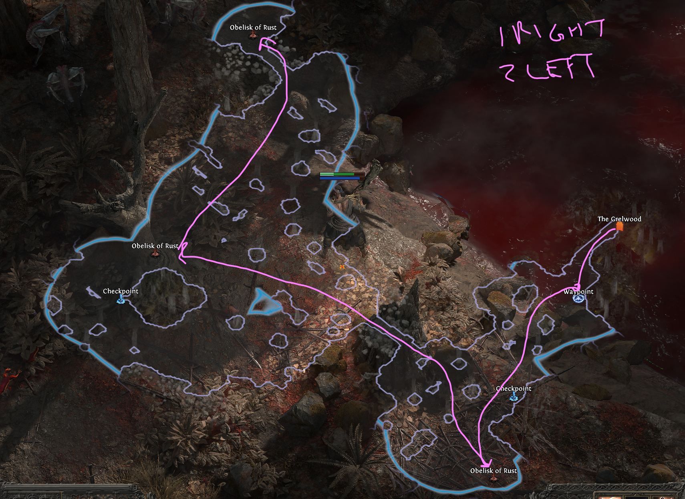

# Act 1 - Route

## Clearfall
1. (Optional) Route for SK1 from Mysterious Chest 
2. Grab Waypoint next to Mud Burrow, will teleport later for SP1
3. Slay Ice Witch for 10% Cold Resistance -- easy kill
4. Travel north to The Grelwood

## The Grelwood - Part 1
Order doesn't matter as this varies. If you find "The Red Vale" last, jump to route in for [The Red Vale](#the-red-vale). If you find either the Witch of Brambles last portal to town and TP The Red Vale
1. (Optional) Kill witch for SP1 -- easier & quicker than Mud Burrow Boss for SP1
2. Unlock waypoint by Tree of Souls (Where the Hooded One Hangs)
3. Unlock waypoint for The Red Vale and zone back
4. (Optional) Kill Brambles Boss for SK2
5. Unlock Grim Tangle Waypoint then teleport to The Red Vale

## The Red Vale
Layout seems to remain similar, basically always one south/bottom right, with two to the west/middle-left and northwest/top left.
1. Run for bottom right obelisk first
2. West most obelisk
3. Nothern most obelisk for boss -- just always staying on his ass seems to make an easy strat
4. Portal to town and talk to Vanly to make Runed Spikes

## Mud Burrow (Optional -- quick SP1): [Skip](#the-grelwood---part-2)
Optional for a second SP1, relatively fast give you're level & hopefully found a few good peices for power.

1. Teleport to Clearfall -- waypoint is next to Mud Burrow
2. Run directly south as much as you can until you make it to boss room
3. He should die quick, once dead portal to town & hand-in for SP1

## The Grelwood - Part 2
Now that you have the relics from The Red Vale you can stab the tree of souls to free
1. Stab three spikes into the tree to release The Hooded One and return to town -- mindful there is one second animation when clicking on each root
2. Take waypoint back to Clearfall Encampment and talk to Una
3. Teleport to Grim Tangle

## The Grim Tangle
1. Talk with Una to unlock and begin searching for the Cemetary of the Eternals
    - Seemingly looking out for the yellow glowing plants seems to be an indicator of the correct direction to go (still testing)
    - Nothing else to do here but run for exit

## Cemetary of the Eternals
1. Discover waypoint by The Grim Tangle zone entrance.
2. (Optional) You may come accross the Ancient Ruin while searching for the next step. This is a chest with free loot, generally underwhelming, but also provides a checkpoint.
3. Begin looking for the following two zones, order of completion does not matter:
    - **Tomb of the Consort** -- lady boss with big AoEs that can hit hard.
        - Route may vary, just find the boss asap and kill. 
    - **Mausoleum of the Praetor** -- dude boss who's only scary when he calls up for lady bosses AoE
        - Route may vary, but just find boss and kill. You may stumble upon a treasure room in here for some extra gold and a chest. 
4. After each of them has been kill return to Lachlann by Cemetary of the Eternals waypoint
5. Follow him to graves and kick some boss butt -- careful of the action when he summons the frosty bird from ground that kamikaze you they hurt.
6. Enter Hunting Grounds after he drops his loot

## Hunting Grounds
1. Unlock waypoint for Hunting Grounds
2. Crowbell Boss for +2 Weapon Skill Passive Points -- look for the area circled in green, the go further to start the boss
3. (Optional) Clear the Druid Ritual for a SK4
4. (Optional) Clear the Ritual Alter for Finn Quest
5. Get the waypoints for "Ogham Farmlands" or "Freythorn", **IF you find Freythorn last, stay here and follow [Freythorn](#freythorn) -- this is for the first SP1 and 30 spirit.

## Freythorn